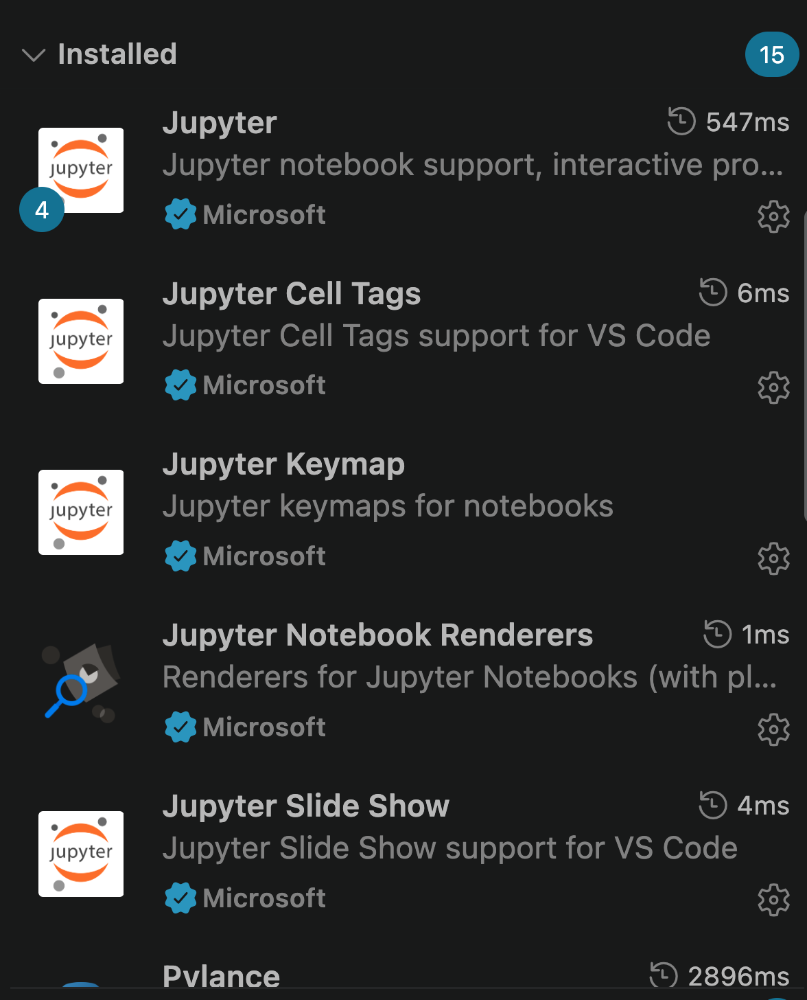
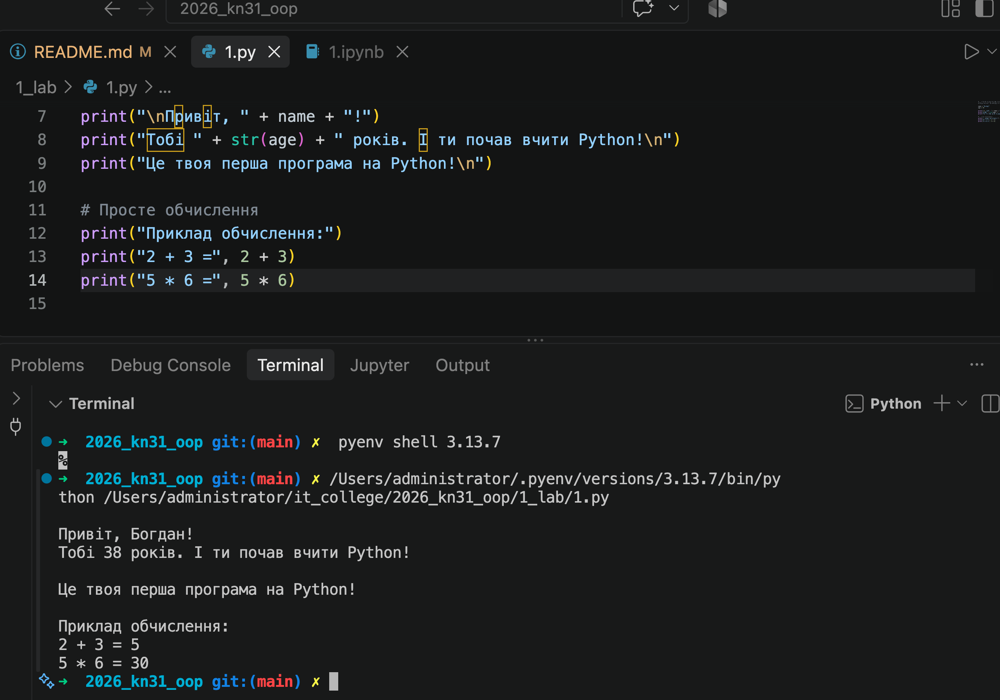
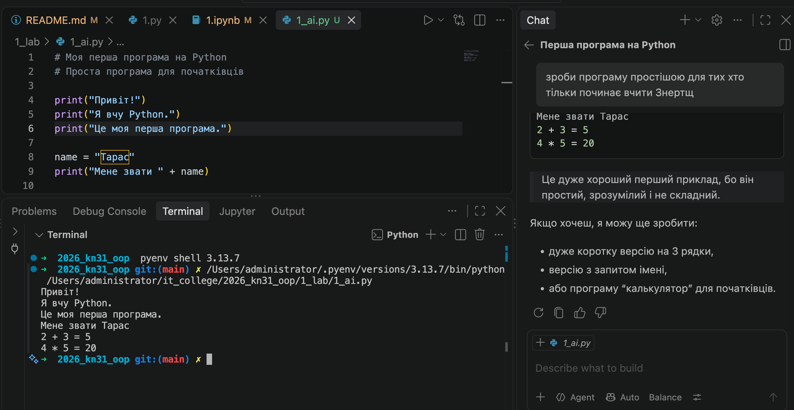

# Звіт до роботи
## Тема: _Оформлення та здача робіт, та перша програма на Python_
### Мета роботи: _налаштувати середовище роботи у VS Code, створити репозиторій GitHub та налаштувати інтеграцію з ним, написати першу програму на Python і створити звіт із використанням форматування Markdown._

---
### Виконання роботи
> Результати виконання завдань:

1. Створили репозиторій на GitHub та налаштували інтеграцію з VS Code та доставили плагіни.
    

1. Написали програму на Python і вивели значення за допомогою кнопки Run Code через плагін Code Runner.
    

1. Створили Jupyter Notebook та запустили його у VS Code. Всі комірки виконуються успішно. Результат можна переглянути за посиланням: [1.ipynb](./1.ipynb)
    
1. Виконали завдання по роботі з Copilot та перевірили його роботу. Результат можна переглянути на скріншоті нижче:
    

---
### Висновок:
> у висновку потрібно відповісти на запитання:

- :question: Що зроблено в роботі: 
    * навчились як за ніч не спати на зробити звіт
    * як вставляти скріншоти у звіт
    * працювати з Copilot та писати запити та перевіряти створені програми
    * перезавантажувати VS Code та компютер, щоб все працювало
    * навчились перечити та не брати до уваги підказки АІ
- :question: Чи досягнуто мети роботи: 
    * так, мета досягнута, але не всі завдання виконані
- :question: Які нові знання отримано:
    * все! перший раз працювати у VS Code та GitHub, а також писати звіт у Markdown
    * як використовувати Jupyter Notebook
- :question: Чи вдалось відповісти на всі питання задані в ході роботи:
    * так, але не всі завдання виконані
- :question: Чи вдалося виконати всі завдання: так
- :question: Чи виникли складності у виконанні завдання: ні
- :question: Чи подобається такий формат здачі роботи (Feedback);
- :question: Побажання для покращення (Suggestions);

---
