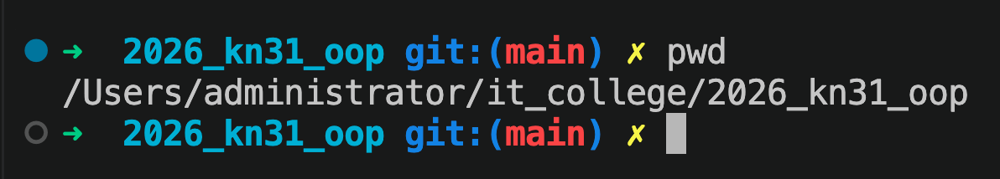

# Практика Markdown
Зміст або швидкий перехід між розділами

[Розділ 1: Практикуємось з вставкою зображень](#практикуємось-з-вставкою-зображень)  
[Останній розділ: Практикуємось з таблицями](#практикуємось-з-таблицями)  

### Практикуємось з вставкою зображень
> УВАГА: далі буде вставка зображень 



### Пракикуємось з вставкою коду

1. Вставка коду у рядок: `print("Hello, world!")`.
1. Вставка коду у блок:
    ```
    Це буде кодовий блок, який можна вставити у текст.
    ```
1. Вставка коду у блок з підсвіткою синтаксису:
    ```python
    print("Hello, world!")
    ```
    ```html
    <h1>Hello, world!</h1>
    ```

### Практикуємось з переходами між розділами


### Практикуємось з таблицями
|№|Завдання|Результат|
|---|:-:|--:|
|1|[Практикуємось з вставкою коду](#пракикуємось-з-вставкою-коду)|Виконано|
|2|[Практикуємось з вставкою зображень](#практикуємось-з-вставкою-зображень)|Виконано|

### Практикуємось в вставками
> [!WARNING]
> це завершення розділу

[Вертаємось до початку](#практика-markdown)
